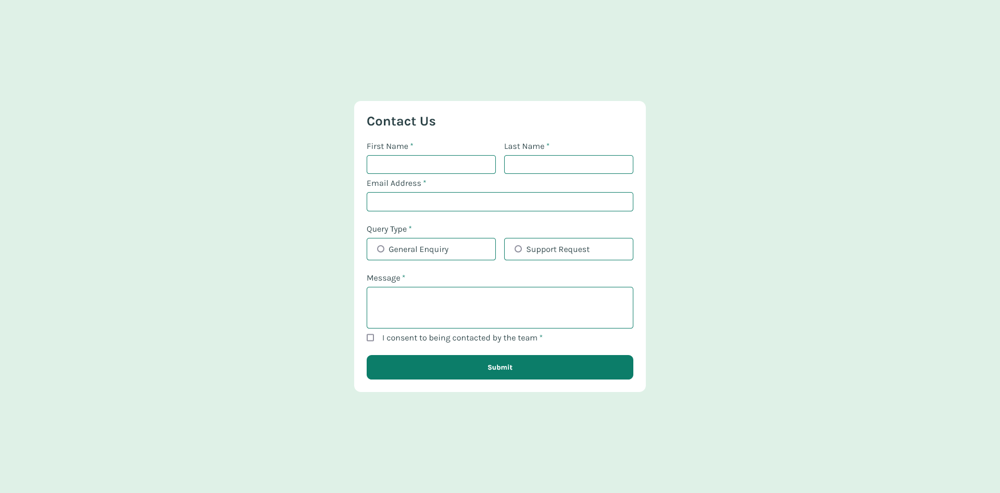

# Frontend Mentor - Contact form solution

This is a solution to the [Contact form challenge on Frontend Mentor](https://www.frontendmentor.io/challenges/contact-form--G-hYlqKJj). Frontend Mentor challenges help you improve your coding skills by building realistic projects.

## Overview

### The challenge

#### **Users should be able to:**

- Complete the form and see a success toast message upon successful submission
- Receive form validation messages if:
  - A required field has been missed
  - The email address is not formatted correctly
- Complete the form only using their keyboard
- Have inputs, error messages, and the success message announced on their screen reader
- View the optimal layout for the interface depending on their device's screen size
- See hover and focus states for all interactive elements on the page

### Screenshot

### Links

- Solution URL: [https://www.frontendmentor.io/solutions/accessible-form-with-react-typescript-zod-react-hook-form-scss-BBGtFiJ6ld](https://www.frontendmentor.io/solutions/accessible-form-with-react-typescript-zod-react-hook-form-scss-BBGtFiJ6ld)
- Live Site URL: [https://www.dev-paull.github.io/contact-form-react/](https://www.dev-paull.github.io/contact-form-react/)

## **Features** 🚀

- 📝 **Collects user data**: First Name, Last Name, Email, Query Type, Message, and Consent.
- ✅ **Form validation** using `react-hook-form` and `zod`.
- ⚠️ **Displays real-time error messages** for invalid inputs.
- 🎉 **Shows a success message** after the form is submitted.
- ♿ **Accessible form** with ARIA labels and descriptions.
- ✨ **Animated success message** using Framer Motion.

## **My Process** 🛠️

- 🔍 **Analyzed** the screenshots and the "User should be able to" requirements.
- 🎨 **Imported** fonts, colors, and image assets.
- 🎛️ **Created** SCSS variables and mixins for reusable styles.
- 📝 **Added** form logic using `react-hook-form` and a Zod schema for validation.
- 🖥️ **Implemented** the desktop design first this time.
- 📱 **Adapted** the form to mobile design.
- ✨ **Created** the Success Message and animated it with Framer Motion.
- ♿ **Improved accessibility** with ARIA attributes and visual indicators (outlines on inputs).
- 🦻⌨️ **Tested** that the form is accessible with keyboard only & screen readers.
- 🚀 **Deployed** on Github pages via Github Action.

I plan to add automated tests. Using `react-hook-form` and `zod` might be overkill for a simple contact form like this, but I’m working on projects with more complex forms, so it’s good practice.

**Any feedback is welcome!**
